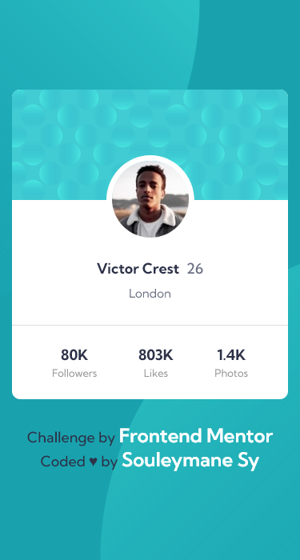

# Frontend Mentor - Profile card component

## Welcome! 👋

Thanks for checking out this front-end coding challenge.

This is a solution to the [Profile card component challenge on Frontend Mentor](https://www.frontendmentor.io/challenges/profile-card-component-cfArpWshJ)

[Frontend Mentor](https://www.frontendmentor.io) challenges help you improve your coding skills by building realistic projects.

## Table of contents

- [The challenge](#the-challenge)
- [Links](#links)
- [Screenshot](#screenshot)
- [Author](#author)

### The challenge

- Build out the project to the designs provided

### Screenshot

This is the Screenshot of the projects a made!

### Mobile

### Desktop

### Links

- Solution URL: [solution URL here](https://www.frontendmentor.io/solutions/profile-card-component-R_sPnAI0ca)
- Live Site URL: [live site URL here](https://fem-profile-card-component-ten.vercel.app/)

## Author

- GitHub - [Souleymane Sy](https://github.com/SouleymaneSy7)
- Frontend Mentor - [@SouleymaneSy7](https://www.frontendmentor.io/profile/SouleymaneSy7)
- Twitter - [@Souleymanesy43](https://twitter.com/Souleymanesy43)
